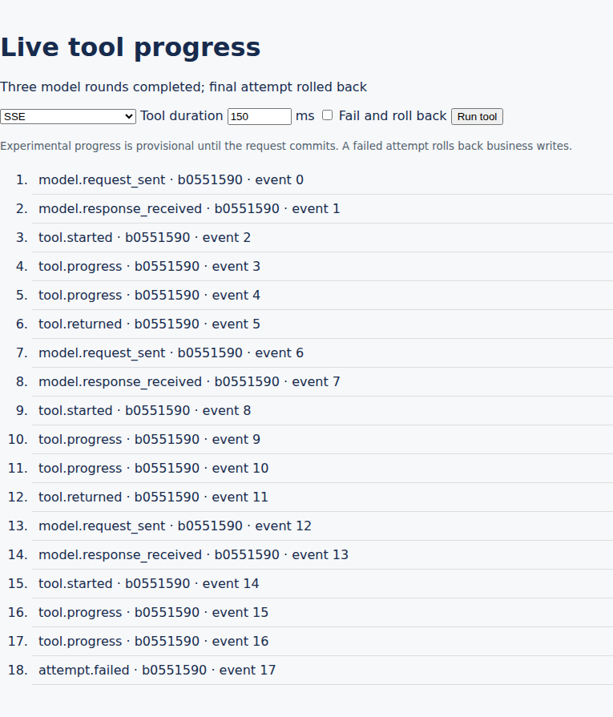

# SSE utility experiment results — 2026-10-01

Keep the separate progress relay for the agent tracer. The experiment demonstrates
useful progress before business commit, with much less synchronous publishing
work than an independent bus transaction. The existing asyncio process is a
reasonable starting architecture. Its publication failure policy and reconnect
behavior need hardening before the tracer is relied upon. Do not remove admission
limits or raise them from a short connection test alone.

This is a synthetic local experiment, not a production sizing guarantee. The
[harness](../scripts/sse_experiment/README.md), [raw results](sse-results/), and
[deferred improvements](sse-improvements.md) are retained in this repository.
The production `sse_server` implementation was not optimized or changed.

## Transaction utility and regular tools

Regular tool delays used the user's 50–500 ms range and an exactly 150 ms weighted
mean: 20% at 50 ms, 40% at 100 ms, 30% at 200 ms, 5% at 300 ms, and 5% at 500 ms.
These controlled waits represent synchronous worker occupation; they are not
measurements of real tools or CPU-bound ORM work. Each trial performed actual
ORM writes and flushes on two experiment-owned records in one real transaction.

There were 40 successes and 40 injected failures per adapter, with order rotated
across adapters. Each request emitted four progress events. An independent
PostgreSQL connection checked visibility during execution and after completion.
Additional five-second success/failure trials tested the long-open-transaction
case. The real browser used the existing SSE SharedWorker; the bus adapter used
the actual Odoo WebSocket endpoint and notification protocol.

| Adapter | Mean first browser DOM update | Mean synchronous API work for four progress events |
| --- | ---: | ---: |
| Normal bus, same business transaction | 171.4 ms | 0.06 ms staging; deferred work excluded |
| Bus, independent progress transactions | 15.8 ms | 47.1 ms |
| SSE, immediate publication | 1.1 ms | 2.8 ms |

The independent bus approach worked: an early **business** commit is unnecessary
if progress uses its own cursor and transaction. The SSE approach used about 2%
of the assumed 150 ms tool time for publishing, versus 31% for four independent
bus publications. This concerns the synchronous tool phase, not the entire
model/tool loop. An external model wait can dominate total elapsed time.
Normal bus staging is cheap because storage and notification happen later; its
staging cost cannot be compared with completed immediate publication as though
it represented the entire delivery cost.

All 123 failed business transactions, including the long diagnostics, left both
probe values at zero. All 123 successes committed both values as one. The
independent observer saw neither uncommitted write during execution. Progress
was present halfway through 80/80 regular SSE trials, 78/80 independent bus
trials, and 0/80 normal bus trials. Both immediate adapters also showed progress
while the five-second transaction remained open and later rolled back.

Browser timestamps measure DOM application, not physical screen paint, and use
millisecond wall-clock resolution. The 1.1 ms value is a local browser result;
network latency and rendering can add time in a real deployment.

## Model/tool loop and tracer

A separate fake provider accepted an HTTP model request immediately, waited two
seconds outside Odoo, and posted its response to an actual HTTP tool worker.
Three model/tool rounds used 150 ms tools; the last round intentionally failed.
Earlier tool writes remained committed and the final pair rolled back in every
adapter. Odoo workers did not stay occupied throughout the model waits.

SSE and independent bus transactions delivered all 18 trace events, including
model requests, responses, tool starts, progress, returns, and the failed attempt.
Normal bus delivered 13: the five events in the failed webhook transaction were
rolled back. That is its transaction semantics, not a transport delivery failure.

The administrator-only prototype at `/sse_experiment` can run a successful or
failed tool with any of the three adapters. All six controls were checked in
Chrome. It is an experimental consumer, not a completed durable agent runtime.

## Matched HTTP publishing and fanout

All adapters were published through equivalent HTTP fixture requests at fixed
offered rates. The matrix used 1/96 physical subscribers, 50/200 logical events
per second, roughly 1 KiB payloads, and three ten-second repetitions per case.
There were 45,000 publications and **2,182,500 expected deliveries across 36
completed windows; every expected delivery was observed**, with no publishing
errors in those windows.

At 96 subscribers and 200 events/s, p99 publication-to-receipt latency was:

| Adapter | p99 across three repetitions |
| --- | ---: |
| Normal bus | 76.9–82.5 ms |
| Independent bus transactions | 79.8–84.8 ms |
| SSE | 10.5–15.5 ms |

The load generator was below saturation for this matrix, although its SSE
consumer used a substantial fraction of one CPU. Subscriber deliveries of the
same event are correlated; the delivery count does not represent millions of
independent statistical trials. These are short repeated windows, not a
delivery guarantee.

Single ten-second payload windows also delivered all expected events at 20
events/s to 96 subscribers, with padding of 16 KiB, 64 KiB, and 240,000 bytes.
SSE p99 was 13.9, 22.6, and 64.4 ms respectively. The largest normal-bus window
hit the generator's CPU limit, so its 815 ms p99 is not a clean server ranking.
The SSE worker also approached one CPU at the largest payload. Large-fanout
payload throughput needs separate generation capacity and further repetitions.
The existing 256 KiB publishing limit covers the entire JSON envelope.

## Deployment and resource budget

The deployment had 20 HTTP workers, one cron worker, one gevent worker, and one
SSE worker. The VM had 12 vCPUs, about 9.7 GiB RAM, no swap, and PostgreSQL 18.6
with `max_connections=100`. Odoo was master/20.1 at
`5bcf314eb0896bdf7e218341a134901004ba3d4d`, using Python 3.14.7.

The experiment provisioned **1,000 real PostgreSQL databases**, totaling
45,925,039,944 bytes (about 42.8 GiB). They were clones of the initialized
experiment database, with demo data and 18 installed modules. The transport
capacity cases actively routed 32 tenants. This does not test 1,000 concurrently
busy production registries or a large business addon set.

The single cron worker scanned only experiment-owned databases. Its final log
recorded 62,000 database-processing iterations and a registry cache size of one.
Those iterations do not imply 62,000 productive cron jobs. HTTP registry cache
capacity was 136; registry optimization was not part of this experiment.

Two configuration constraints surfaced:

* Default process pools exhausted the shared PostgreSQL connection budget during
  the initial load ramp. Those failed windows were excluded from the successful
  matched matrix. The resource-fit profile used `db_maxconn=3` and
  `db_maxconn_gevent=16`, giving ten cooperative bus dispatch tasks. Functional
  latency trials initially used the default pools and 43 dispatch tasks.
* The initial soft open-file limit was 1,024. Capacity tests explicitly raised it
  to 65,536 in the isolated instance and generator. Proxy capacity was not raised
  or measured at large connection counts: those protocol tests connected
  directly to the relay/gevent endpoints.

Bus connection ramps could also exhaust transient cursor capacity when closing
one large cohort and opening another. Steady-capacity tests warmed registries,
started from the current bus ID, paced connection opening/closing, and allowed
close callbacks to settle. Ramp failures remain recorded separately. A paced
steady test is not proof of resilience to a real reconnect storm.

## Connection capacity depends on delivery work

Only the two SSE admission constants were overridden in the test process, to
32,768 globally and per tenant. Queue size, payload cap, deadlines, framing,
and five-minute ticket lifetime stayed unchanged. An additional test-only cron
selection hook kept other projects' databases out of the scan. Production source
remained unchanged, and the original admission gates were restored and checked
after the capacity phase.

For database-wide broadcast across 32 active tenants at 200 logical events/s,
delivery work grows with the subscriber count. Two fifteen-second repetitions
and a refinement sweep found:

| SSE connections | Approximate frame rate | p99 across repetitions | Worker CPU |
| --- | ---: | ---: | ---: |
| 2,560 | 16,000/s | 9–29 ms | about 66% of one CPU |
| 3,072 | 19,200/s | 182–183 ms | about 79% |
| 3,584 | 22,400/s | 95–1,004 ms | about 87–94% |
| 4,096 | 25,600/s | 625–1,215 ms | about 94% |

CPU estimates include sending and the final one-second drain and are approximate.

The 4,096 case had publication errors and missed events in one repetition.
This is a fanout/CPU boundary for this workload, not a 4,096-socket operating
system limit. An initial limit around 2,048 would leave useful headroom for
this particular broadcast profile; it would still require renewal validation.

The more relevant agent profile used one stream per connection and 200 total
events/s, each directed to one subscriber. Short tests accepted 4,096, 8,192,
and 16,384 connections, observed every scheduled delivery, and measured p99 of
about 1.2, 1.5, and 1.9 ms respectively. At 16,384, the SSE worker used about
367 MiB PSS, 16,484 file descriptors, and about 16% of one CPU. Many connections were
idle between updates. These tests used locally signed capabilities and exclude
login/authorization throughput and a production reverse proxy.

## Fifteen-minute coexistence and renewal

The longer mixed test ran 8,192 individual SSE streams at 200 events/s alongside
1,024 bus connections at 50 business-style notifications/s across 32 active
tenants, ordinary HTTP probes, and the thousand-database cron scan.

| Measurement | SSE | Bus |
| --- | ---: | ---: |
| Scheduled publications | 180,000 | 45,000 |
| Expected deliveries | 180,000 | 1,440,000 |
| Observed deliveries | 179,471 (99.706%) | 1,440,000 (100%) |
| Delivery p99 | 11.9 ms | 27.9 ms |
| Publication errors | 538 | 0 |
| Automatic lease renewals | 24,576 | 0 |

SSE errors occurred during synchronized five-minute renewals. Both publication
timeouts and Unix connection errors appeared. Some publications reported an
error yet reached a subscriber, illustrating the uncertainty of a lost ACK.
There were no recorded duplicate deliveries in either long-test driver.
Ordinary HTTP probe p99 was about 23/15 ms with no errors. SSE file descriptors
stayed around 8,292; sampled PSS settled around 272 MiB after renewal allocations.

The sender and thousands of protocol clients shared a load-generator process;
renewal bursts can delay sending and produce catch-up bursts. The generator can
contribute to this failure. Nevertheless, this is **not validation of a safe
8,192 admission cap**. Protocol clients also signed replacement tickets locally;
real browser authorization would add HTTP work.

Separately, the unmodified browser SharedWorker ran for 920 seconds at one
event/s. All 920 publications were accepted, but only 917 appeared in the DOM.
Three natural ticket expirations caused 1.5–1.7 second reconnect gaps. There is
no replay, so the three missing progress events remained missing.

A separate rare synchronous-wait profile occupied zero, one, then two HTTP
workers for ten seconds while offering 50 ordinary reads/s during the mixed
test. All 1,500 reads and all held requests succeeded; p99 stayed about
12–23 ms. This models occupied workers, not a real image-generation provider,
and does not establish behavior near HTTP saturation.

## Publication failure and recommendation

Pausing only the isolated SSE child exposed the current API contract. A normal
bus tool request still committed both probe writes. The direct SSE `publish()`
call timed out after about one second, failed the HTTP request, and prevented
its business writes. The child was resumed immediately. A progress transport
failure should be handled explicitly by the caller; it should not accidentally
decide the business operation's outcome.

Keep the one-process, database-free asyncio relay and the normal bus for
committed business notifications. This fits the existing harness direction.
The need is transaction-independent progress; an independent bus transaction is
a working alternative when its cost and retained history are appropriate.

Before relying on the tracer, add a generic progress API with explicit
provisional/committed semantics and a nonfatal publication policy; recover the
UI from durable run state; and fix lease renewal/recovery through staggered
renewal and bounded replay or snapshot reconciliation. Review encoding once and
persistent IPC only against the measured fanout bottleneck. Make admission and
traffic budgets configurable while retaining bounded queues and deadlines.

For now, retain the original 128-per-database/1,024-global policy. It is a
conservative bootstrap policy, not a measured universal maximum. The experiment
shows substantial low-fanout headroom, but the long renewal test prevents
recommending an unqualified increase. Revalidate any higher cap after recovery
and publication failure handling, with the actual proxy, authorization path,
tenant activity, payload/fanout mix, and resource budget.
